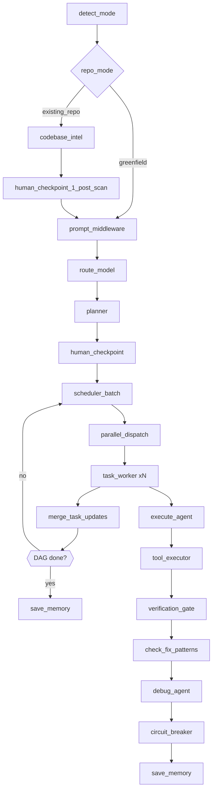

# SAGE Architecture (MVP → Phase 4)

## Notes
- Tool execution is sandboxed and governed by safety rules (`ToolExecutionEngine`).
- Parallel scheduling uses LangGraph when available, otherwise falls back to a rule-based worker pool.
- Phase 4 observability emits `PROMPT_QUALITY_DELTA` and `TRAJECTORY_STEP` events into the session journal.

